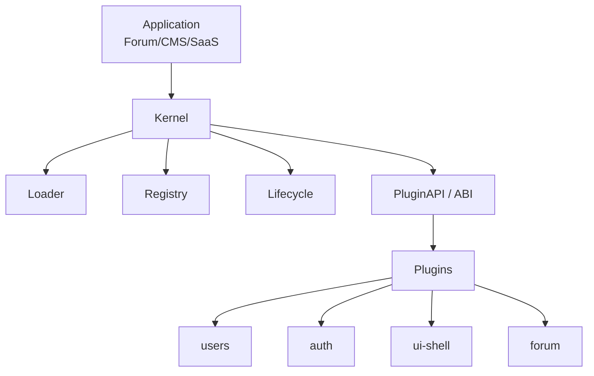

# 插件化论坛系统

本项目基于 Django-Ninja 构建一个“后端/前端统一插件 ABI”的系统内核（Kernel），通过插件提供业务能力。当前实现了核心内核、基础系统插件（users/auth/ui-shell）以及业务插件（forum）。

## 架构图



## 目录结构

```text
backend/
├─ core/                  # Kernel
│  ├─ plugin/             # Loader/Registry/Lifecycle/Runtime
│  ├─ rbac/               # RBAC 模型与工具
│  └─ api.py              # 全局 NinjaAPI
├─ plugins/               # 插件目录
│  ├─ users/              # 用户插件
│  ├─ auth/               # 认证插件
│  ├─ ui_shell/           # UI Shell 插件
│  └─ forum/              # 论坛业务插件
└─ badge/                 # Django 项目配置
```

## ABI 文档（V1）

ABI（Application Binary Interface）在此指 **Kernel 向插件暴露的稳定接口**，插件只能通过 ABI 调用系统能力。

### PluginAPI

`PluginAPI` 在插件启用时注入，当前提供的能力如下：

- `add_router(router, prefix=None, tags=None)`  
  挂载 Django-Ninja 路由。默认前缀为 `/{plugin_name}`。
- `emit(event_name, **kwargs)`  
  触发事件。
- `subscribe(event_name, handler)`  
  订阅事件。
- `is_enabled(plugin_name)`  
  查询插件是否启用。
- `enabled_plugins()`  
  获取已启用插件列表。

### 插件 Manifest（plugin.yaml）

```yaml
name: forum
version: 1.0.0
api_version: 1
entry: plugins.forum.plugin:Plugin
dependencies:
  - users
mount:
  api_prefix: /forum
description: Forum posts and comments
```

字段说明：
- `name`：插件唯一标识
- `version`：插件版本
- `api_version`：ABI 版本
- `entry`：插件入口类
- `dependencies`：依赖插件列表
- `mount.api_prefix`：建议的 API 前缀
- `description`：描述

### 生命周期钩子

插件入口类需实现 `on_enable(self, api: PluginAPI)`：

```python
class Plugin:
    def on_enable(self, api):
        api.add_router(router, tags=["forum"])
```

### 事件模型

内核内置事件总线，插件可触发或订阅：

- `user_created`
- `user_deleted`

示例（forum 插件监听用户删除）：

```python
def on_user_deleted(user_id: int):
    Comment.objects.filter(author_id=user_id).delete()
    Post.objects.filter(author_id=user_id).delete()
```

## 本地运行

```bash
python backend/manage.py migrate
python backend/manage.py runserver
```

常用接口：
- `GET /api/plugins/manifests`
- `GET /api/users/`
- `POST /api/auth/login`
- `GET /api/forum/posts`

## 插件开发快速上手

详见 `docs/DEV_GUIDE.md`。

## 前端与后台

- 前端入口：`frontend/index.html`
- 管理后台：`#/admin`（在前端应用内）
- 前端开发文档：`docs/FRONTEND_GUIDE.md`


## Plugin System Updates
- Added PluginAPI.unsubscribe for cleanup in on_disable.
- Added optional on_disable hook for plugin teardown.
- Enforced ABI version support (currently api_version=1).
- validate_plugins now checks frontend route/menu conflicts.
